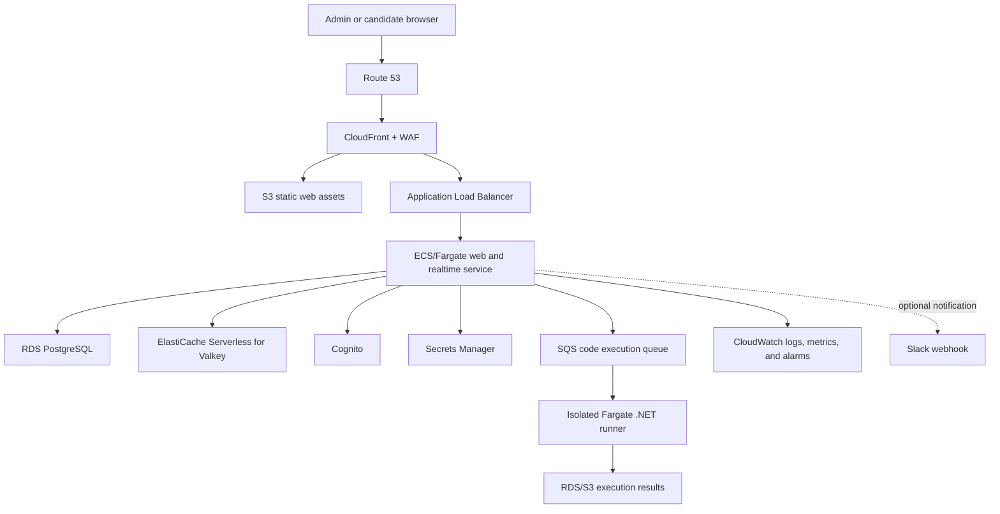

# AWS migration plan

## Purpose

This document describes how to move CollabCode from Vercel, Firebase, and the
current third-party execution/analytics services to an AWS-hosted architecture.
It is a plan, not an instruction to begin the migration immediately.

The migration should preserve the current user experience:

- An administrator can create, leave, and resume an interview.
- A candidate can join with a short session code.
- Both users see editor changes and question changes in real time.
- Presence, candidate activity, notes, answer keys, custom question sets, and
  session history continue to work.
- C# code can be compiled and run without sending candidate code to Wandbox or
  a public Piston service.

## Executive recommendation

Use a containerized Node/Express application on **Amazon ECS with AWS Fargate**,
backed by **Amazon RDS for PostgreSQL**. Replace Firebase's live synchronization
with a WebSocket collaboration service running alongside the application and
use **Amazon ElastiCache Serverless for Valkey** for ephemeral presence and
cross-container messages.

Host browser assets in **Amazon S3** behind **Amazon CloudFront**, route the API
and WebSocket paths through an **Application Load Balancer**, and use
**Amazon Cognito** for administrators. Run submitted C# in short-lived,
restricted Fargate tasks rather than inside the web application.

This is intentionally not a one-for-one product swap. Firebase currently acts
as the database, event bus, presence service, and Firepad transport. RDS should
hold durable records; Valkey and WebSockets should handle transient real-time
state.

## Current platform inventory

| Current dependency | What it does now | Proposed AWS replacement |
| --- | --- | --- |
| Vercel | Static hosting and Node serverless API routes | S3 + CloudFront for static files; ECS/Fargate for Node API |
| Firebase Realtime Database | Sessions, users, settings, notes, questions, activity, security events, and live updates | RDS PostgreSQL for durable data; Valkey + WebSockets for live events and presence |
| Firepad | Shared Ace editor contents and cursors | Yjs with an Ace binding and an ECS-hosted WebSocket server |
| Firebase Admin SDK | Server-side Firebase access | PostgreSQL data-access layer and IAM-controlled AWS clients |
| Custom JWT/admin passwords | Administrator authentication | Cognito User Pool; short-lived interview tokens for candidates |
| Wandbox/Piston | C# and other code execution | SQS plus isolated, one-execution Fargate tasks |
| PostHog | Browser analytics | CloudWatch metrics plus an RDS event table; optionally Athena/QuickSight later |
| Slack webhook | Interview alerts | Keep Slack as the destination, but send from the backend with its secret in Secrets Manager |
| Vercel environment variables | Runtime configuration and secrets | ECS task configuration, Systems Manager Parameter Store, and Secrets Manager |

## Target architecture

### Networking

- Use one VPC spanning at least two Availability Zones.
- Put the Application Load Balancer in public subnets.
- Put ECS tasks, RDS, and ElastiCache in private subnets.
- Permit inbound traffic to ECS only from the load balancer.
- Permit database and cache traffic only from the application security group.
- Give code-runner tasks a separate security group with no route to RDS,
  ElastiCache, or application secrets.
- Add VPC endpoints for S3, ECR, CloudWatch Logs, Secrets Manager, and SQS where
  practical. This reduces both public exposure and NAT Gateway traffic.
- Use ACM certificates and HTTPS only. Route 53 can manage the application
  domain.

### Web application

Create one Docker image for the existing Node/Express application. Initially it
may serve both the static app and API to reduce migration risk. The final form
should publish versioned static assets to S3 and leave the ECS service
responsible for:

- REST API endpoints
- WebSocket connections
- session and question-set operations
- authentication/authorization checks
- candidate activity and notes
- dispatching code-execution jobs

Run at least two ECS tasks across Availability Zones in production. The service
should expose a health endpoint that checks application health without making a
database write. Configure graceful shutdown so deployments stop accepting new
connections, allow existing requests to finish, and prompt WebSocket clients to
reconnect.

### Durable data in RDS

PostgreSQL is recommended because it is capable, well supported on RDS, and
avoids SQL Server licensing cost. RDS for SQL Server is also viable if the
application itself must demonstrate or reuse SQL Server-specific code. The
interview questions can still be about SQL Server even when the application's
own persistence uses PostgreSQL.

Suggested tables:

| Table | Purpose |
| --- | --- |
| `users` | Administrator identities and roles, linked to Cognito subject IDs |
| `interview_sessions` | Code, status, owner, timestamps, and active question |
| `session_participants` | Administrator/candidate membership and display name |
| `question_sets` | Included and administrator-created set metadata |
| `questions` | Prompt, language, answer key, order, and grading guidance |
| `session_questions` | Frozen copy/version of questions used by a session |
| `editor_snapshots` | Periodic and final editor state for recovery/history |
| `session_notes` | Interviewer-only notes and evaluation |
| `activity_events` | Tab changes, idle events, joins, leaves, and timestamps |
| `security_events` | Duplicate-login and other security warnings |
| `execution_jobs` | Language, state, timing, sanitized result, and owner |

Use UUID primary keys internally and keep the six-digit session code as a
separately indexed, unique, human-facing value. Add indexes for session code,
session status/owner, question-set owner, and event timestamps. Define retention
rules for editor snapshots, activity events, and execution output rather than
retaining all interview data forever.

Production should use an encrypted Multi-AZ RDS deployment with automated
backups and point-in-time recovery. A smaller Single-AZ instance is reasonable
for a non-production environment.

### Replacing Firebase real-time behavior

RDS alone does not replace Firebase subscriptions. Add a real-time layer:

1. Browsers connect to an authenticated WebSocket endpoint through the ALB.
2. Each interview is a logical room identified by its internal session ID.
3. Use Yjs documents to synchronize Ace editor contents and selections.
4. Each ECS task publishes room events through Valkey so users connected to
   different tasks see the same changes.
5. Presence and heartbeat data live in Valkey with short expirations.
6. Important events and periodic editor snapshots are written to PostgreSQL.
7. On reconnect, the client loads the latest snapshot and applies subsequent
   updates.

Do not make Valkey the permanent record. Losing transient presence data should
only make users reconnect; it must not erase question sets, notes, interviews,
or completed code.

ALB stickiness may be used during the first migration, but the finished design
should not depend on it. Shared pub/sub and reconnect logic allow any healthy
ECS task to accept the connection.

### Authentication and authorization

Recommended model:

- Create administrators in a Cognito User Pool.
- Use Cognito groups such as `owner` and `admin`.
- Require verified email and enable MFA for the owner account.
- The backend validates Cognito access tokens and enforces ownership/role
  checks; hiding a control in the browser is not authorization.
- A candidate joins with the session code and receives a short-lived,
  session-scoped token from the backend.
- Candidate tokens can edit the shared document and read candidate-safe
  questions, but cannot read answer keys, administrator notes, admin lists, or
  other sessions.
- Store no reusable candidate password.

As a lower-risk transition, the first ECS release can retain the current JWT
flow while moving secrets to Secrets Manager. Cognito can then be introduced
after the application is running on AWS.

### Safe C# execution

Never install the .NET compiler in the main web container and execute arbitrary
candidate code there. A runaway program could consume the interview service's
CPU, read its environment variables, or reach its database.

Use the following job flow:

1. The API accepts a bounded source file, validates its size and language, and
   creates an `execution_jobs` row.
2. The API sends the job ID to SQS.
3. A dispatcher starts a dedicated Fargate task with a .NET SDK runner image.
4. The runner receives only the source/job payload it needs. It has no
   application task role, database password, Slack secret, or internal network
   access.
5. The runner uses strict CPU, memory, disk, process, and wall-clock limits.
6. Outbound internet access is disabled.
7. The root filesystem is read-only except for a small ephemeral work area.
8. The result is written through a narrowly scoped result channel, then the task
   exits.
9. The browser polls or receives a WebSocket completion event.

Cold starts will make this slower than an always-on public compiler, but it is a
reasonable first implementation for five-minute interview exercises. If usage
grows, introduce a small warm pool of equally isolated runner tasks. Never reuse
a work directory between candidates.

### Static hosting and content delivery

- Build the browser application during CI.
- Upload hashed assets to a private S3 bucket.
- Serve them through CloudFront using Origin Access Control.
- Route `/api/*` and the WebSocket path to the ALB.
- Use a short cache lifetime for `app.html` and long immutable caching for
  hashed JS/CSS assets.
- Configure the default route so `/` loads the application rather than the old
  repository/star landing page.

### Secrets and configuration

Put credentials and signing material in Secrets Manager:

- database credentials
- transitional JWT secret
- Slack webhook
- any migration-only Firebase credentials

Use Parameter Store or ECS environment variables for non-secret configuration.
Use task IAM roles instead of static AWS access keys. Rotate the previously
exposed Firebase/API credentials before migration work begins, and never commit
export files or service-account JSON.

### Monitoring and operations

Send structured application and runner logs to CloudWatch Logs. Include
correlation IDs, session IDs, and job IDs, but exclude source code, answer keys,
tokens, passwords, and personal notes.

Create alarms for:

- no healthy ECS targets
- elevated API 5xx responses
- WebSocket disconnect/reconnect spikes
- ECS CPU/memory saturation
- RDS CPU, connections, storage, and failover events
- Valkey memory/connection pressure
- SQS queue age and failed execution jobs
- code-runner timeouts and abnormal exit rates

Use CloudWatch custom metrics for product-level counts that currently go to
PostHog. Store audit-worthy events in PostgreSQL. Athena and QuickSight can be
added later if historical product analytics warrants the extra cost.

## Infrastructure as code and delivery

Define all AWS resources with one infrastructure-as-code system. AWS CDK in
TypeScript is a natural fit for this Node project; Terraform is equally
acceptable if it matches the team's existing AWS practice. Do not construct the
production environment manually in the console.

Recommended GitHub Actions pipeline:

1. Run linting and automated tests.
2. Build the browser bundle and application Docker image.
3. Scan dependencies and the container image.
4. Authenticate to AWS with GitHub's OIDC federation, not long-lived AWS keys.
5. Push the image to ECR.
6. Apply reviewed infrastructure changes.
7. Upload static assets to S3.
8. Deploy the ECS service using rolling or blue/green deployment.
9. Run smoke tests against a temporary or production target.
10. Invalidate only changed CloudFront entry points when necessary.

Use separate AWS accounts, or at minimum separate VPCs and databases, for
production and non-production.

## Migration phases

### Phase 0: decisions and baseline

- Decide PostgreSQL versus SQL Server for the application's own database.
- Choose CDK or Terraform.
- Record current API endpoints, Firebase paths, environment variables, and
  expected browser behavior.
- Add automated smoke tests for login, session creation/resume, question
  loading, answer-key permissions, live editing, notes, activity, and C# run.
- Capture normal traffic and latency so the AWS version has measurable targets.
- Rotate the exposed Google/Firebase key and verify GitHub secret-scanning
  alerts are resolved.

**Exit criterion:** The team can prove whether each critical workflow still
works after a deployment.

### Phase 1: run the current application on ECS

- Add a production Dockerfile and local container workflow.
- Provision VPC, ECR, ECS/Fargate, ALB, ACM, Route 53, CloudWatch, and secrets.
- Deploy the existing application while temporarily retaining Firebase and the
  current compiler integration.
- Point a staging hostname at AWS and run smoke tests.

This bridge phase separates the hosting move from the data/realtime rewrite. It
should be short-lived; it is not the final architecture.

**Exit criterion:** The application works through the AWS hostname and can be
rolled back without changing production DNS.

### Phase 2: introduce PostgreSQL repositories

- Create the schema and migrations.
- Replace direct Firebase access for question sets, admin data, sessions,
  notes, and historical events with backend API calls.
- Export Firebase data as JSON, transform it, and import it into PostgreSQL.
- Compare record counts and sampled records.
- Temporarily dual-write only where doing so is safe and observable.
- Freeze custom-question edits briefly for the final delta migration.

**Exit criterion:** Durable application state is read from RDS, and Firebase is
no longer the system of record.

### Phase 3: replace authentication

- Configure Cognito users, groups, hosted/custom login, and MFA policy.
- Migrate additional administrators by invitation rather than copying password
  hashes.
- Implement session-scoped candidate tokens.
- Test all authorization boundaries, especially answer keys and notes.

**Exit criterion:** Firebase and the legacy password store are not required to
authenticate or authorize users.

### Phase 4: replace Firepad and Firebase presence

- Add the Yjs WebSocket service and Ace integration.
- Add Valkey room pub/sub and expiring presence records.
- Persist editor snapshots and session events in RDS.
- Test reconnects, browser refreshes, task replacement during deployment, two
  administrators, and multiple candidates attempting to join.
- Migrate only recoverable snapshots for active sessions; do not attempt a
  live cutover while an interview is in progress.

**Exit criterion:** Live editing, question changes, connected-user lists, and
candidate activity work with Firebase disabled.

### Phase 5: move code execution to AWS

- Build and scan the isolated .NET runner image.
- Add SQS, dispatcher, task definition, result handling, and timeouts.
- Add abuse controls: payload limits, per-session rate limits, concurrency
  quotas, and an emergency disable switch.
- Test infinite loops, excessive output, process spawning, filesystem access,
  network access, compiler errors, and successful programs.
- Remove Wandbox/Piston configuration after an observation period.

**Exit criterion:** C# compilation and execution works without an external code
execution provider and cannot reach application data or secrets.

### Phase 6: cut over and retire old platforms

- Schedule a window with no active interviews.
- Put the old application into maintenance/read-only mode.
- Export and import the final Firebase delta.
- Run data validation and end-to-end tests.
- Change DNS/CloudFront routing to AWS.
- Monitor errors, connections, and queue latency closely.
- Keep the old deployment and a final Firebase export available for the agreed
  rollback window.
- After the window, revoke Firebase credentials, remove Firebase client config,
  disable Vercel deployments, and remove PostHog/Wandbox/Piston code.

**Exit criterion:** Production has run stably through the rollback window and
no production path calls the retired services.

### Phase 7: hardening and disaster recovery

- Enable/verify RDS point-in-time recovery and AWS Backup policies.
- Add S3 lifecycle and retention policies.
- Conduct a database restore drill.
- Conduct an ECS/Availability Zone failure exercise.
- Document operator runbooks for deployment rollback, database restore,
  disabled code execution, and compromised administrator credentials.
- Review costs and right-size ECS, RDS, Valkey, log retention, and NAT usage.

## Data migration and rollback

Before the final cutover:

1. Create an immutable Firebase export and store it encrypted in a restricted
   S3 migration bucket.
2. Transform Firebase's nested JSON into relational rows using repeatable,
   version-controlled migration tooling.
3. Preserve original Firebase keys in temporary mapping columns/tables so
   relationships can be audited.
4. Validate totals per entity, required fields, ownership, session status, and
   a sample of editor/question/notes records.
5. Record the import version and checksum.

Rollback should mean routing users back to the previous deployment and restoring
its ability to write. Because writes can diverge after cutover, set a short,
explicit rollback window and maintain an event log that can be replayed. After
that window, recovery should use the AWS backups rather than returning to
Firebase.

Do not migrate a currently active interview. Let it finish or schedule the
cutover outside interview hours.

## Security checklist

- WAF managed rules and rate limits protect public HTTP endpoints.
- Cognito MFA is enabled for privileged administrators.
- Every backend operation checks the caller's session and role.
- RDS, Valkey, and ECS tasks use encryption in transit and at rest.
- RDS and Valkey have no public endpoint.
- ECS task roles follow least privilege.
- Runner tasks have no application credentials or unrestricted egress.
- Secret values never appear in logs, browser bundles, GitHub, or task
  definitions as plaintext.
- CloudTrail is enabled and retained.
- Container images and npm packages are scanned during CI.
- Database migrations are backed up and tested before production execution.
- Personal data and interview history have documented retention/deletion rules.

## Cost-conscious starting point

For a personal or lightly used staging deployment:

- one small ECS web task
- one small Single-AZ RDS PostgreSQL instance
- S3/CloudFront static hosting
- no permanent runner tasks; use Fargate only when Run is pressed
- Valkey introduced when multi-task real-time behavior is tested

For production interviews:

- at least two ECS web tasks across Availability Zones
- Multi-AZ RDS
- Valkey with appropriate availability
- WAF, alarms, backups, and restore testing

A NAT Gateway can be surprisingly expensive in a small stack. Prefer VPC
endpoints and deliberately control which workloads need internet egress.
Do not reduce production to one ECS task or Single-AZ RDS merely to save a small
amount during an interview; schedule the environment or use smaller resources
instead.

## Acceptance criteria

The AWS migration is complete when:

- Vercel serves no production traffic.
- No browser or server code connects to Firebase.
- Firepad is removed and two users can edit/reconnect without losing work.
- Administrators can log in, add administrators, create/resume sessions, and
  retain loaded questions across refreshes.
- Candidates cannot access answer keys, notes, administrative controls, or
  other sessions.
- RDS contains durable session, question, note, snapshot, and audit data.
- Presence and cross-task live events survive an ECS task replacement.
- C# code runs in isolated AWS tasks, and compiler/runtime errors are returned
  clearly to the candidate.
- Wandbox, public Piston, and PostHog are not required.
- Dashboards, alarms, backups, restore procedures, and rollback instructions
  have been tested.

## Decisions to make before implementation

1. PostgreSQL or SQL Server for CollabCode's own persistence?
2. CDK or Terraform for infrastructure?
3. What interview/session data must be retained, and for how long?
4. Is preserving old editor history necessary, or are final snapshots enough?
5. What is an acceptable delay after pressing Run?
6. Should Slack alerts remain, or should they be replaced by SNS/email?
7. What recovery objectives are required? A reasonable initial target is an
   RPO of 15 minutes and an RTO of 60 minutes, but the owner should choose these.

## Suggested implementation backlog

1. Add smoke tests and document current Firebase paths.
2. Add Dockerfile and container health endpoint.
3. Create CDK/Terraform foundation: VPC, ECR, ECS, ALB, logs, and staging DNS.
4. Deploy the existing app to AWS staging.
5. Add PostgreSQL schema and repository layer.
6. Add export/transform/import tooling and reconciliation report.
7. Move durable endpoints from Firebase to RDS.
8. Add Cognito administrator and candidate-token flows.
9. Add Yjs WebSockets, Valkey pub/sub, presence, and snapshots.
10. Add the isolated C# execution pipeline.
11. Add WAF, alarms, backup policies, and operational runbooks.
12. Rehearse migration and rollback.
13. Cut over production and retire old integrations.

## Primary AWS references

- [Getting started with ECS on
  Fargate](https://docs.aws.amazon.com/AmazonECS/latest/developerguide/getting-started-fargate.html)
- [Load balancing for ECS
  services](https://docs.aws.amazon.com/AmazonECS/latest/developerguide/service-load-balancing.html)
- [Fargate task-definition differences and resource
  limits](https://docs.aws.amazon.com/AmazonECS/latest/developerguide/fargate-tasks-services.html)
- [ECS `RunTask`
  API](https://docs.aws.amazon.com/AmazonECS/latest/APIReference/API_RunTask.html)
- [RDS Multi-AZ
  deployments](https://docs.aws.amazon.com/AmazonRDS/latest/UserGuide/Concepts.MultiAZ.html)
- [ElastiCache
  documentation](https://docs.aws.amazon.com/AmazonElastiCache/latest/dg/WhatIs.html)
- [Amazon Cognito
  documentation](https://docs.aws.amazon.com/cognito/)
- [AWS Secrets Manager
  documentation](https://docs.aws.amazon.com/secretsmanager/)
- [CloudFront with an S3
  origin](https://docs.aws.amazon.com/AmazonCloudFront/latest/DeveloperGuide/DownloadDistS3AndCustomOrigins.html)
- [AWS WAF
  documentation](https://docs.aws.amazon.com/waf/)

